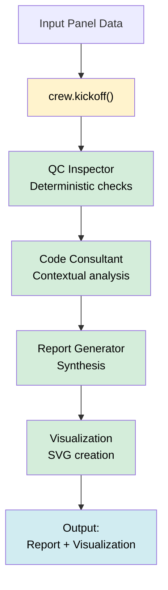

# Wall Panel Quality Control - CrewAI Orchestration

A proof-of-concept exploring how CrewAI orchestrates multi-agent workflows for building code compliance. This project uses wall panel inspection as a use case to demonstrate agent collaboration and structured reasoning.

## Overview

Building code compliance has two aspects:

- **Deterministic Rules**: Explicit requirements (e.g., "studs must be spaced 16\" apart")
- **Contextual Analysis**: Requirements dependent on context (e.g., seismic zone considerations)

This project demonstrates how multiple agents within CrewAI can address both aspects collaboratively. The LLM-based agent applies natural language rules from markdown files and generates detailed remediation plans for identified violations.

## Architecture

The system uses four specialized agents orchestrated through CrewAI. Each agent handles a specific responsibility:

### Agent Responsibilities

| Agent            | Role                     | Input                         | Output                          |
| ---------------- | ------------------------ | ----------------------------- | ------------------------------- |
| QC Inspector     | Building code compliance | Panel data + rules            | Deterministic violations        |
| Code Consultant  | Expert judgment          | Panel data + contextual rules | Violations with remediation     |
| Report Generator | Synthesis                | All violations                | Comprehensive report            |
| Visualization    | Diagram creation         | Panel + violations            | Base SVG (Python) + annotations |

## Getting Started

### Prerequisites

- Python 3.10+
- [uv](https://docs.astral.sh/uv/) package manager
- API key for your CrewAI-compatible LLM (only required if you run the contextual analysis agent)

### Setup

```bash
git clone <repository-url>
cd crewai-poc
uv sync
# Only needed when running with an LLM-enabled agent
export OPENAI_API_KEY="your-key-here"
```

### Running

```bash
# Execute the workflow (generates SVGs in demo_output/)
uv run scripts/demo.py

# View remediation recommendations
uv run python scripts/view_remediation.py demo_output/*_remediation.json
```

## Key Features

### Natural Language Rules

The Code Consultant agent processes human-readable inspection guidelines from `config/contextual_rules.md` alongside structured JSON rules. This allows the system to interpret contextual requirements that are difficult to encode as deterministic rules.

### Remediation Plans

For each violation identified, the LLM generates actionable remediation plans including:

- Step-by-step fix instructions
- Required materials and tools
- Time and cost estimates
- Safety considerations
- Engineer approval requirements

Remediation recommendations are saved as JSON files in `demo_output/` for downstream integration.

## Workflow



## Test Cases

### Good Panel

- Centered window, low seismic zone
- Passes all deterministic + contextual checks
- SVG renders with green studs and ✅ status text

### Bad Panel

- Corner window, high seismic zone
- Deterministic checks flag missing support + spacing issues
- Context rule adds seismic bracing violation, SVG shows red studs + summary text

## Project Structure

```
scripts/
  └─ demo.py                    # Workflow orchestration

crew/
  ├─ agents.py                  # Agent definitions
  └─ tasks.py                   # Task definitions

tools/
  ├─ deterministic_checker.py   # Rule validation + context helpers
  ├─ llm_rule_checker.py        # LLM analysis (optional)
  ├─ visualizer_tool.py         # SVG generation
  ├─ svg_annotator.py           # Deterministic annotations
  └─ crew_tools.py              # Tool utilities

config/
  ├─ building_codes.json        # Rule definitions
  ├─ contextual_rules.md        # Natural language inspection rules
  └─ exceptions.json            # Context rules

demo_output/
  ├─ good_panel_001.svg         # Generated visualizations
  ├─ good_panel_001_remediation.json
  ├─ bad_panel_001.svg
  └─ bad_panel_001_remediation.json
```

## Implementation Notes

### Agent Execution

- Deterministic, contextual, and reporting agents run inside a single `Crew`
- Visualization now happens in pure Python after `crew.kickoff()` to guarantee valid SVG output

### LLM Integration

The Code Consultant agent loads `config/contextual_rules.md` at initialization, enabling it to apply natural language inspection guidelines alongside structured rules. The agent generates detailed remediation plans for each violation, which are saved to JSON files for downstream processing.

### Violation + Visualization Flow

1. QC Inspector runs rules engineered in `deterministic_checker.py`
2. Code Consultant evaluates contextual scenarios using natural language rules and generates remediation plans
3. Crew synthesizes the narrative output
4. `visualizer_tool.create_panel_visualization` draws a clean panel
5. `svg_annotator.annotate_svg_with_crew` appends violation summaries deterministically
6. Remediation recommendations are saved to `demo_output/` as JSON files

All generated SVGs open in any standards-compliant viewer; "good" panels render with green studs and a pass footer, while "bad" panels show red studs and textual violation summaries.

## Technologies

- **CrewAI** - Multi-agent orchestration
- **OpenAI GPT-3.5-turbo** - LLM reasoning and remediation generation
- **Pydantic v2** - Type validation
- **uv** - Package management
