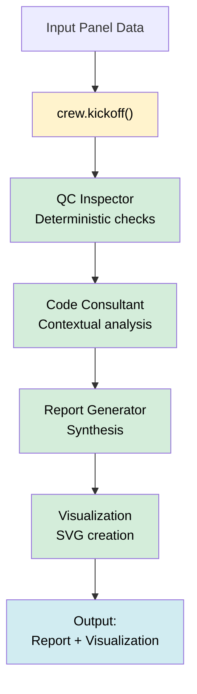

# Wall Panel Quality Control - CrewAI Orchestration

A proof-of-concept exploring how CrewAI orchestrates multi-agent workflows for building code compliance. This project uses wall panel inspection as a use case to demonstrate agent collaboration and structured reasoning.

## Overview

Building code compliance has two aspects:

- **Deterministic Rules**: Explicit requirements (e.g., "studs must be spaced 16\" apart")
- **Contextual Analysis**: Requirements dependent on context (e.g., seismic zone considerations)

This project demonstrates how multiple agents within CrewAI can address both aspects collaboratively.

## Architecture

The system uses four specialized agents orchestrated through CrewAI. Each agent handles a specific responsibility:

### Agent Responsibilities

| Agent | Role | Input | Output |
|-------|------|-------|--------|
| QC Inspector | Building code compliance | Panel data + rules | Deterministic violations |
| Code Consultant | Expert judgment | Panel data + deterministic results | Context-dependent violations |
| Report Generator | Synthesis | All violations | Comprehensive report |
| Visualization | Diagram creation | Panel + violations | SVG visualization |

## Getting Started

### Prerequisites

- Python 3.10+
- [uv](https://docs.astral.sh/uv/) package manager
- OpenAI API key

### Setup

```bash
git clone <repository-url>
cd crewai-poc
uv sync
export OPENAI_API_KEY="your-key-here"
```

### Running

```bash
# Execute the workflow
uv run scripts/demo.py

# Verify agent-based violations (not hardcoded)
uv run verify_crew_orchestration.py
```

## Workflow



## Test Cases

### Good Panel

- Centered window, low seismic zone
- Passes all rule checks
- No violations expected

### Bad Panel

- Corner window, high seismic zone
- Passes rule checks (proper structural support)
- Contextual analysis flags seismic risk

## Project Structure

```
scripts/
  └─ demo.py                    # Workflow orchestration

crew/
  ├─ agents.py                  # Agent definitions
  └─ tasks.py                   # Task definitions

tools/
  ├─ deterministic_checker.py   # Rule validation
  ├─ llm_rule_checker.py        # LLM analysis
  ├─ visualizer_tool.py         # SVG generation
  ├─ crew_tools.py              # Tool utilities
  └─ output_parser.py           # Output parsing

config/
  ├─ building_codes.json        # Rule definitions
  └─ exceptions.json            # Context rules

demo_output/
  ├─ good_panel.svg             # Generated visualizations
  └─ bad_panel.svg
```

## Implementation Notes

### Agent Execution

- All agents execute within `crew.kickoff()`
- No logic outside the crew orchestration
- Results passed through CrewAI's memory system

### Violation Generation

All violations originate from agent reasoning:

1. QC Inspector analyzes against building codes
2. Code Consultant performs contextual analysis
3. Results synthesized into comprehensive report
4. Visualization agent creates annotated diagram

No hardcoded violation lists.

## Technologies

- **CrewAI** - Multi-agent orchestration
- **Claude** - LLM reasoning
- **Pydantic v2** - Type validation
- **uv** - Package management
